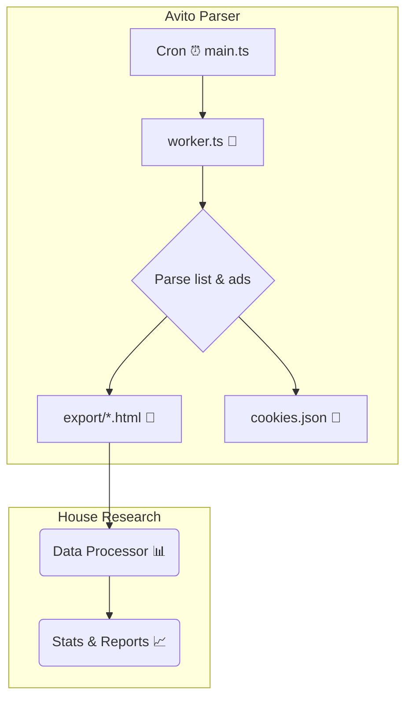

# 🏠 Avito Parser – *House Research* Branch

&#x20; &#x20;

&#x20;

> **Avito Parser** — самодостаточная ветка проекта **House Research**. Скрипт 🚜 ежечасно парсит объявления с Avito, сохраняет HTML локально и передаёт данные в основной движок статистики.

---

## ⚡️ Ключевые возможности

| 🚀 Возможность               | 🎯 Описание                                                                                |
|------------------------------|--------------------------------------------------------------------------------------------|
| ⏰ **Cron‑парсинг**           | Автоматически запускается раз в час через `Deno.cron`, не допускает параллельных запусков. |
| 🔍 **Сканирование списков**  | Обходит выдачу Avito, раскрывая последующие страницы до самого конца.                      |
| 📰 **Сохранение объявлений** | Каждое объявление сохраняется целиком в `export/*.html` для последующего анализа.          |
| 🍪 **Менеджер cookies**      | Хранит и восстанавливает куки, уменьшая вероятность блокировки.                            |
| 🛡️ **Firewall‑bypass**      | Обнаруживает заглушки Avito‑Firewall и дожидается снятия блокировки.                       |

---

## 🗺️ Архитектура



---

## 📦 Быстрый старт

### 1️⃣ Docker Compose

> **Минимальная конфигурация** — обновите `AVITO_URL` до нужного запроса.

```yaml
version: "3.9"
services:
  avito-parser:
    image: ghcr.io/zxcnoname666/avito-parser:latest
    container_name: avito-parser
    restart: unless-stopped
    volumes:
      - ./export:/app/export
    environment:
      AVITO_URL: "https://www.avito.ru/all/kvartiry/sdam/na_dlitelnyy_srok" # 💡 ваш фильтр
```

```bash
# Запуск
$ docker compose up -d
```

### 2️⃣ Локальная разработка

```bash
# Клонировать ветку
$ git clone -b avito-parser https://github.com/zxcnoname666/House-Research.git
$ cd House-Research

# Установить зависимости (Deno + JSR)
$ deno task install

# Запустить парсер
$ deno run -A src/main.ts
```

> **Требования:** Deno ^1.46 с поддержкой `--unstable`.

---

## 🛠️ Конфигурация окружения

| Переменная  | Значение по умолчанию | Описание                                                         |
| ----------- | --------------------- | ---------------------------------------------------------------- |
| `AVITO_URL` | —                     | Абсолютная ссылка на поиск Avito (вместе с параметрами фильтра). |
| `HEADLESS`  | `false`               | Запуск браузера без GUI (может повысить шанс блокировки).        |

> Для продакшена рекомендован headless‑режим **false** и прокси‑ротация.

---

## 🤝 Вклад

1. Откройте *issue* 📌 с описанием бага или фичи.
2. Форк ➡️ ветка `feature/your‑awesome‑idea`.
3. PR + описание изменений.
4. Получите 👍 ревью и 🚀 merge!

\:tada: Спасибо за помощь в развитии проекта!

---

## 📝 Лицензия

Код распространяется под лицензией **MIT**. Свободно используйте, модифицируйте и распространяйте — но не забывайте ⭐ звёздочку!
