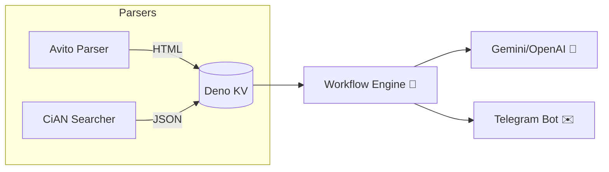

# 🏠 House Research — AI‑powered real‑estate monitor

[](https://github.com/zxcnoname666/House-Research/stargazers)
[](https://github.com/zxcnoname666/House-Research/network/members)
[](https://github.com/zxcnoname666/House-Research/issues)
[](https://github.com/zxcnoname666/House-Research/commits)
[](LICENSE)

> **House Research** — комплексная система, которая автоматически 📡 собирает объявления о недвижимости, анализирует их с помощью 🧠 ИИ и публикует красочные сводки в Telegram. Экономьте часы ручного мониторинга и получайте только действительно интересные предложения!

---

## ✨ Что умеет проект

| 🚀 Возможность                | Описание                                                                                                                  |
| ----------------------------- | ------------------------------------------------------------------------------------------------------------------------- |
| 🔄 **Мульти‑источники**       | Avito (HTML‑парсер `avito-parser` 🔗 [ветка](https://github.com/zxcnoname666/House-Research/tree/avito-parser)) + Циан (неофициальный API). |
| 🤖 **ИИ‑оценка**              | Генерация рейтинга «выгодно / переплата» с учётом цены, инфраструктуры и фото.                                            |
| 🛫 **Быстрый запуск**         | Docker‑композ для продакшена и Deno‑tasks для разработки.                                                                 |
| 🚏 **Транспорт + провайдеры** | Поиск ближайших остановок и доступных интернет‑операторов.                                                                |
| 🖼️ **Коллаж изображений**    | Склейка фото объявления в единый предварительный коллаж.                                                                  |
| 📬 **Отправка в Telegram**    | Фото‑альбом ➕ HTML‑сообщение, распределение по темам чата.                                                                |
| 🐳 **Docker Ready**           | Готовые контейнеры (`ghcr.io`) для деплоя на сервере или VPS.                                                             |

---

## 🗺️ Архитектура



---

## 🔍 Как это работает

### Avito Parser

* Отдельная ветка [`avito-parser`](https://github.com/zxcnoname666/House-Research/tree/avito-parser) содержит самодостаточный скрипт на Deno.
* Раз в час 🕐 (через `Deno.cron`) он обходит результаты поиска Avito и сохраняет каждый лот в `export/*.html`.
* HTML затем читается основным движком для извлечения характеристик и тенденций рынка.

### Циан Searcher

* Для доступа к полноценному поиску Циан требуется **профиль агента**. Залогиньтесь, перейдите в поиск и скопируйте все cookie запросов к циану — поместите значение в `CIAN_SEARCH_COOKIE`.
* Парсер берёт фильтр из `.yaml`‑конфигов, добавляет cookie и получает JSON со всеми объявлениями.

### Поддержка нескольких API‑ключей

Укажите ключи OpenRouter, Gemini, Nvidia, etc.. через запятую:

```env
OPENROUTER_API_KEY=key_one,key_two,key_three
GEMINI_API_KEY=gk1,gk2
```

При достижении дневного лимита ⚡️ библиотека автоматически переключится на следующий токен.

---

## 🚀 Быстрый старт (Docker Compose)

> Минимальный пример поднимает два контейнера: основной обработчик + Avito Parser.

```yaml
version: "3.9"
services:
  house-research:
    image: ghcr.io/zxcnoname666/house-research:latest
    container_name: house-research
    restart: always
    volumes:
      - ./kv:/app/kv           # Deno KV (SQLite)
      - ./conf:/app/conf       # конфигурация YAML
      - ./avito-export:/avito-export # HTML объявлений
    env_file:
      - .env

  avito-parser:
    image: ghcr.io/zxcnoname666/avito-parser:latest
    container_name: avito-parser
    restart: always
    volumes:
      - ./avito-export:/app/export
    environment:
      AVITO_URL: "https://www.avito.ru/..."  # ваш фильтр
```

```bash
$ docker compose up -d
```

> **Подсказка:** создайте `.env` на основе `.env.example` и заполните токены Telegram, OpenRouter/Gemini, RapidAPI и cookie Циан‑агента.

---

## 🧑‍💻 Локальная разработка

```bash
# Клонируем репозиторий
$ git clone https://github.com/zxcnoname666/House-Research.git
$ cd House-Research

# Установка зависимостей (JSR + Deno)
$ deno task install

# Dev‑режим с горячей перезагрузкой
$ deno task dev --unstable
```

Для отдельного Avito Parser:

```bash
$ git checkout avito-parser
$ deno run -A src/main.ts
```

---

## ⚙️ Переменные окружения (основное)

| Переменная           | Обязательно | Описание                                    |
| -------------------- | ----------- | ------------------------------------------- |
| `BOT_TOKEN`          | ✅           | Токен Telegram‑бота.                        |
| `TELEGRAM_CHAT_ID`   | ✅           | ID чата/канала для публикации.              |
| `AVITO_URL`          | ✅           | URL поиска Avito (с параметрами фильтра).   |
| `CIAN_SEARCH_COOKIE` | ✅           | Cookie авторизованного профиля агента Циан. |
| `OPENROUTER_API_KEY` | ❌           | Один или несколько ключей через запятую.    |
| `GEMINI_API_KEY`     | ❌           | Аналогично, поддержка нескольких ключей.    |

> Полный список — в `.env.example`.

---

## 🤝 Как внести вклад

1. Откройте **issue** 📌 с описанием бага или улучшения.
2. Сделайте **fork** → `feature/my‑awesome‑feature`.
3. Отправьте **PR** с чётким описанием.
4. Получите 👍 ревью и 🚀 merge!

---

## 📝 Лицензия

Проект распространяется под лицензией **MIT** — используйте свободно и не забудьте поставить ⭐!

---

<p align="center">
  
</p>
<p align="center"></p>
